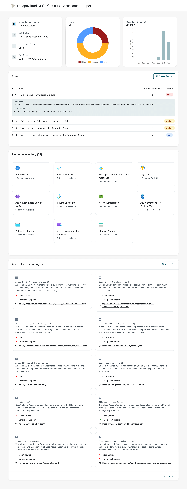
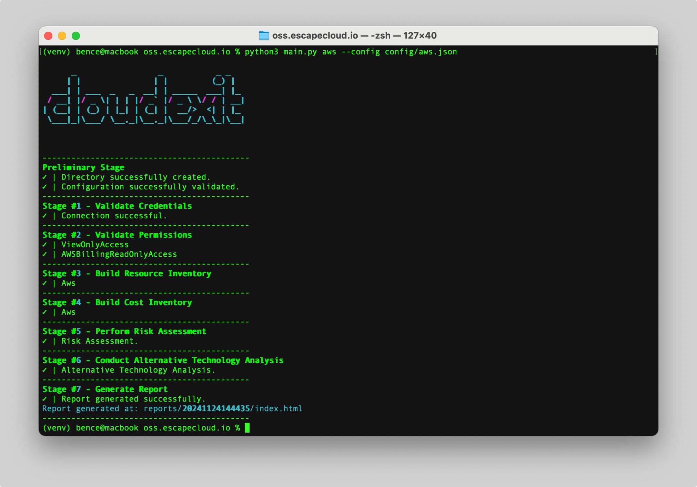
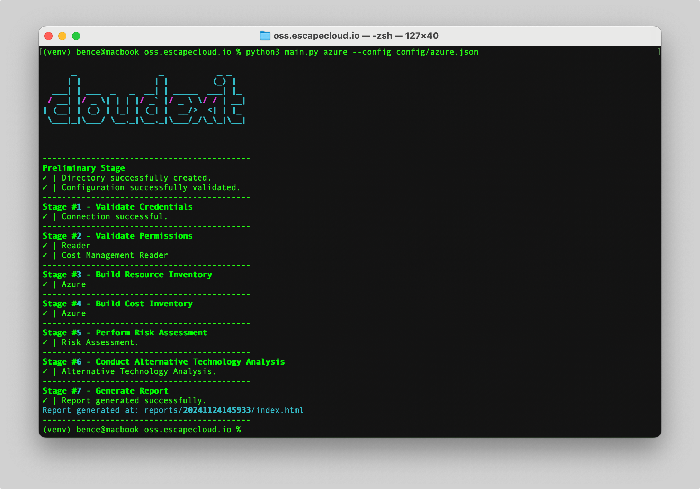

# Cloud Exit Assessment


cloudexit is an open-source tool that empowers cloud engineers to conduct comprehensive cloud exit assessments. It helps identify and evaluate the risks associated with their cloud environment while providing actionable insights into the challenges and constraints of transitioning away from their current cloud provider. By leveraging EscapeCloud Community Edition, organizations can better prepare for a potential cloud exit, ensuring a smoother and more informed decision-making process.

**Update: 20-07-2025**

We’re excited to announce the launch of exitcloud.io on September 1st, 2025, bringing together EscapeCloud’s alternative technology dataset with newly developed scoring methodologies. The updated version of CloudExit will allow you to:

- Connect to your exitcloud.io account

- Perform more in-depth assessments using advanced scoring models

- Generate more detailed reports

The Basic assessment will remain available forever, with no account or API key required. *(If you’re interested in participating in our Beta program, please reach out to: beta(@)escapecloud(.)io)*

**ExitCloud - Lightweight Cloud Exit Readiness for MSPs and SMEs**

Link: [https://exitcloud.io](https://exitcloud.io/)

**EscapeCloud - The Cloud Exit Readiness Platform**

Link [https://escapecloud.io](https://escapecloud.io/)

## Required Packages

>```bash
># Optional: Set up a virtual environment
>python3 -m venv ./venv
>source venv/bin/activate
>
># Install required dependencies
>python3 -m pip install -r requirements.txt
>```

## Required Permissions
To conduct the assessment, the following role assignments or policies must be attached to the generated credentials:

| Cloud Provider  | Required Permissions |
| ------------- | ------------- |
| Microsoft Azure  | Reader & Cost Management Reader  |
| Amazon Web Services  | ViewOnlyAccess & AWSBillingReadOnlyAccess  |

## Getting Started

Once you have installed the required dependencies, you can use 'cloudexit' interactively via the console or by providing configuration files for a streamlined workflow:

```python
python3 main.py

# Run with manual input for AWS:
python3 main.py aws

# Run with a configuration file for AWS:
python3 main.py aws --config config.json

# Run with an AWS CLI profile:
python3 main.py aws --profile PROFILE

# Define assessment name:
python3 main.py aws --name

# Run with manual input for Azure:
python3 main.py azure

# Run with a configuration file for Azure:
python3 main.py azure --config config.json

# Run with Azure CLI credentials:
python3 main.py azure --cli

# Define assessment name:
python3 main.py azure --name
```

The results are saved in the reports folder. Simply open the index.html file in the newly generated folder.

Each assessment creates a new folder named after its timestamp, containing both raw and standardized data.



## **Config**
The following parameters are common across configuration files for different cloud providers. They define the scope and context of the cloud exit assessment:
### **name**
Assessment Name (Optional)

### **cloudServiceProvider**
| Cloud Provider  | Value |
| ------------- | ------------- |
| Microsoft Azure  | 1  |
| Amazon Web Services  | 2  |
| Google Cloud Platform  | TBD  |
| Alibaba Cloud  | TBD  |

### **exitStrategy**
| Strategy  | Value |
| ------------- | ------------- |
| Repatriation to On-Premises  | 1  |
| Hybrid Cloud Adoption  | TBD  |
| Migration to Alternate Cloud  | 3  |

### **assessmentType**
| Type  | Value | Comment |
| ------------- | ------------- | ------------- |
| Basic  | 1  | No API Key required. |
| Standard  | 2  | API Key required.  |

### **providerDetails**
AWS Example Configuration:

```
{
    "name": "DMS System",
    "cloudServiceProvider": 2,
    "exitStrategy": 3,
    "assessmentType": 1,
    "providerDetails":{
      "accessKey":"AKAAXASJHMTOST9YTLHE",
      "secretKey":"",
      "region":"eu-central-1"
   }
}
```


*Using a configuration file for the required parameters.*

Azure Example Configuration:
```
{
    "name": "DMS System",
    "cloudServiceProvider": 1,
    "exitStrategy": 3,
    "assessmentType": 1,
    "providerDetails":{
      "clientId":"a5d7a310-26a4-115f-b679-ca01f0d73b75",
      "clientSecret":"",
      "tenantId":"38986009-9ded-42b3-b187-55f1cb61560a",
      "subscriptionId":"1299bf8a-8ca8-478b-8659-c62e62cd7baa",
      "resourceGroupName":"test-project"
   }
}
```


*Using a configuration file for the required parameters.*

## License

This project is licensed under the [GNU Affero General Public License v3](https://www.gnu.org/licenses/agpl-3.0.html).

## Contributing
Contributions are welcome!

Feel free to reach out for any questions or feedback.
