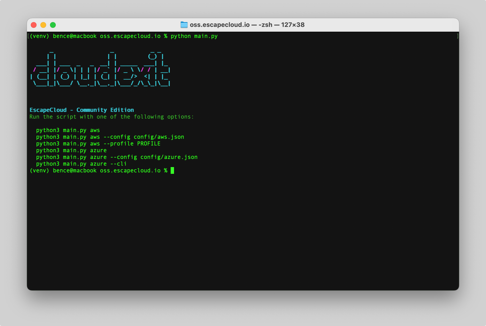

# cloudexit – Cloud Exit Assessment (Open Source)

cloudexit is an open-source tool that helps cloud engineers and technical teams assess **cloud exit readiness**.

It provides a structured, repeatable way to understand:
- what cloud services are in use
- where vendor lock-in risks exist
- how difficult an exit scenario would be
- what alternative technologies are available

cloudexit runs **locally by default**, with no account required.

   

---

## How cloudexit fits into the EscapeCloud ecosystem

cloudexit is the **Community / Open Source edition** of the EscapeCloud ecosystem.

- **cloudexit (this repository)**  
  Open-source, offline-first assessment engine

- **exitcloud.io**  
  Lightweight Cloud Exit Readiness Platform for individuals, SMEs, and MSPs

- **escapecloud.io**  
  Enterprise Cloud Exit Readiness Platform with advanced reporting and governance

cloudexit can be used:
- fully offline (Basic assessment)
- connected to a platform (exitcloud.io / escapecloud.io) for richer reports and scoring
- in CI/CD via the [cloudexit GitHub Action](https://github.com/marketplace/actions/github-action-for-cloudexit) for automated assessments

---

## Documentation

📘 **Full documentation:**  
👉 https://cloudexit.escapecloud.io

The documentation covers:
- getting started and prerequisites
- running assessments
- cloud providers and permissions
- reports and scores
- connected mode (exitcloud.io / escapecloud.io)
- troubleshooting and contribution guidelines

---

## License

cloudexit is licensed under the  
**GNU Affero General Public License v3 (AGPL-3.0)**

See the [LICENSE](https://www.gnu.org/licenses/agpl-3.0.html) file for details.

---

## Contributing

Contributions are welcome.

You can contribute by:
- reporting issues
- improving documentation
- submitting pull requests

Please see the documentation for contribution guidelines.
