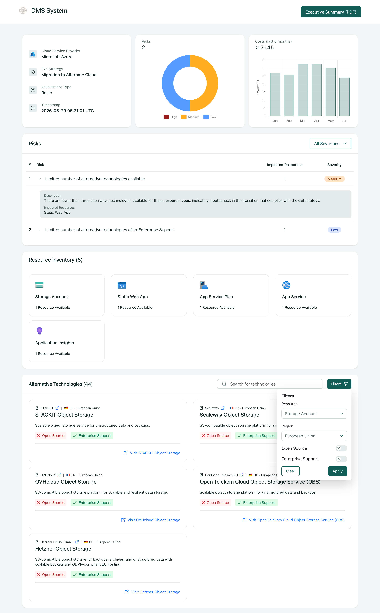

<p align="center">
  
</p>

<p align="center">
  <strong>Know your exit before you're locked in.</strong><br />
  Open-source cloud exit assessment CLI. Runs locally, no account required.
</p>

<p align="center">
  <a href="https://opensource.org/licenses/AGPL-3.0"></a>
  
  
  
  
</p>

<p align="center">
  <a href="#quick-start">Quick Start</a> ·
  <a href="#what-you-get">What you get</a> ·
  <a href="#cloud-providers">Providers</a> ·
  <a href="#configuration">Configuration</a> ·
  <a href="#cicd">CI/CD</a> ·
  <a href="#ecosystem">Ecosystem</a> ·
  <a href="https://cloudexit.escapecloud.io">Docs</a>
</p>

---

## What is cloudexit?

cloudexit is a free, open-source CLI that assesses your **cloud exit readiness**. It connects to your AWS or Azure account with read-only credentials, builds a full resource and cost inventory, scores your vendor lock-in risk across service categories, and produces an HTML, PDF, and JSON report — all locally, with no account required.

It is the open-source foundation of the [EscapeCloud](https://escapecloud.io) ecosystem.

## Quick Start

**Prerequisites:** Python 3.12+, and either an AWS CLI profile or an Azure CLI session.

```bash
git clone git@github.com:escapecloud/cloudexit.git
cd cloudexit
python -m venv .venv && source .venv/bin/activate
pip install -r requirements.txt
```

Run your first assessment:

```bash
# AWS — using your existing CLI profile
python main.py aws --profile default

# Azure — using your Azure CLI session
az login
python main.py azure --cli
```

Reports are written locally as HTML, PDF, and JSON. Full credential and permissions setup is covered in the [documentation](https://cloudexit.escapecloud.io).

## What you get

cloudexit produces a structured exit readiness report covering:

- **Resource Inventory** — every service in use within the defined scope
- **Cost Inventory** — monthly cost breakdown within the defined scope
- **Risk Assessment** — rule-based evaluation of exit feasibility across each identified service
- **Alternative Technologies** — open-source and portable replacements for each identified cloud service, with additional details such as company ownership and location



## Cloud Providers

| Provider | Required permissions |
|---|---|
| Amazon Web Services | [AWS permissions →](https://cloudexit.escapecloud.io/cloud-providers/aws.html) |
| Microsoft Azure | [Azure permissions →](https://cloudexit.escapecloud.io/cloud-providers/azure.html) |

See the [permission reference](https://cloudexit.escapecloud.io/cloud-providers/required-permissions.html) for details.

> Google Cloud Platform & Oracle Cloud Infrastructure is on the roadmap.

## Configuration

The CLI supports multiple input modes for both AWS and Azure.

**AWS**

| Mode | Command |
|---|---|
| Interactive (manual credentials) | `python main.py aws` |
| AWS CLI profile | `python main.py aws --profile PROFILE` |
| JSON config file | `python main.py aws --config config.json` |
| Terraform/OpenTofu state file | `python main.py aws --tfstate infra.tfstate` |
| Non-interactive (env vars, CI) | `python main.py aws --non-interactive` |

**Azure**

| Mode | Command |
|---|---|
| Interactive (service principal) | `python main.py azure` |
| Azure CLI session | `python main.py azure --cli` |
| JSON config file | `python main.py azure --config config.json` |
| Terraform/OpenTofu state file | `python main.py azure --tfstate infra.tfstate` |
| Non-interactive (env vars, CI) | `python main.py azure --non-interactive` |

See the [configuration reference](https://cloudexit.escapecloud.io/config/config-schema.html) for required permissions and config file format.

Want to see how a regulatory-aligned report looks (DORA / FINMA / UK PRA)? Run with `--dry-run` and send the output `payload.json` to request_report@escapecloud.io — we'll generate a sample you can share with your risk or compliance team.

## Data Landscape & Egress Estimation (alpha)

Add `--egress` to any assessment to measure how much data lives in the assessed scope and estimate the one-time internet egress fee for moving it out — based on the provider's tiered list prices, with no additional permissions required.

```bash
python main.py azure --cli --egress
python main.py aws --profile PROFILE --egress
```

See the [egress reference](https://cloudexit.escapecloud.io/egress/overview.html) for details.

## Infrastructure-as-Code State Scan (alpha)

Instead of connecting to a cloud account, cloudexit can build the assessment from a local **Terraform / OpenTofu state file** — no credentials, no API calls, nothing leaves your machine.

```bash
python main.py aws --tfstate infra.tfstate
python main.py azure --tfstate infra.tfstate
```

If your state lives in a remote backend (S3, Azure Storage, Terraform Cloud, …), export it first:

```bash
terraform state pull > infra.tfstate
```

See the [infrastructure-as-code reference](https://cloudexit.escapecloud.io/tfstate/overview.html) for details.

## CI/CD

cloudexit runs headlessly in CI pipelines via `--non-interactive` and environment variables. A ready-made GitHub Action is available:

```yaml
- uses: escapecloud/cloudexit-action@v1
  with:
    provider: aws
  env:
    AWS_ACCESS_KEY_ID: ${{ secrets.AWS_ACCESS_KEY_ID }}
    AWS_SECRET_ACCESS_KEY: ${{ secrets.AWS_SECRET_ACCESS_KEY }}
    AWS_DEFAULT_REGION: us-east-1
    ESC_EXIT_STRATEGY: 1
    ESC_ASSESSMENT_TYPE: 1
```

[View on GitHub Marketplace →](https://github.com/marketplace/actions/github-action-for-cloudexit)

## Ecosystem

cloudexit is the open-source, offline-first tier of a broader platform.

| Tier | Description |
|---|---|
| **cloudexit** (this repo) | CLI, offline Basic assessment, local reports |
| **[exitcloud.io](https://exitcloud.io)** | Lightweight platform for individuals, SMEs, and MSPs — adds scoring, history, and richer reports |
| **[escapecloud.io](https://escapecloud.io)** | Enterprise platform with advanced reporting, governance, and regulatory evidence (DORA, FINMA, UK PRA) |

Running cloudexit offline always produces a Basic assessment. Connect it to exitcloud.io or escapecloud.io for full scoring and report features.

## Contributing

Contributions are welcome — bug reports, documentation improvements, new service mappings, and pull requests.

See the [contribution guidelines](https://cloudexit.escapecloud.io/contributing/how-to-contribute.html) for details.

## License

cloudexit is licensed under the **GNU Affero General Public License v3 (AGPL-3.0)**.  
See [LICENSE](./LICENSE) for details.
