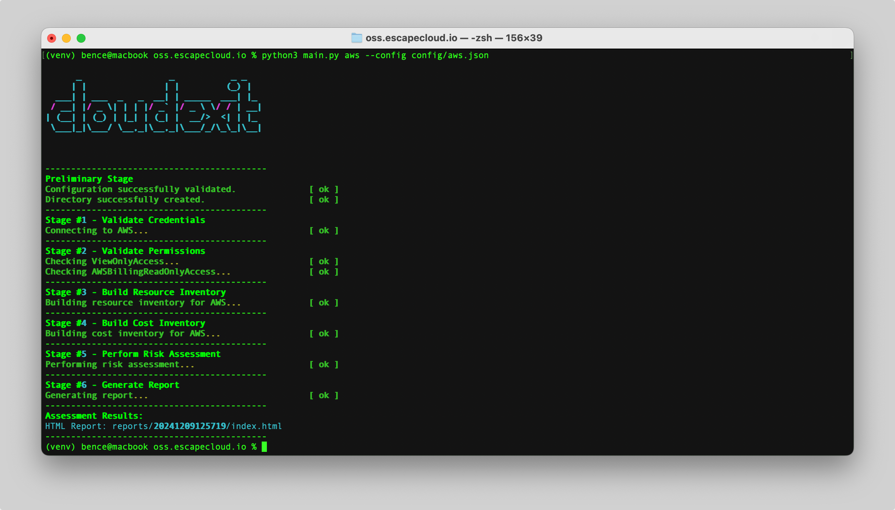
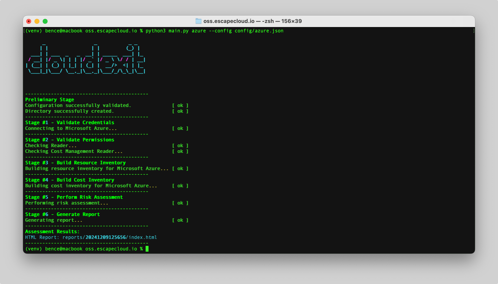

# Cloud Exit Assessment

**EscapeCloud Platform:** [https://escapecloud.io](https://escapecloud.io/)

**ExitCloud.io (One-Time Assessment):** [https://exitcloud.io](https://exitcloud.io/)

**Read our release blog:**
[https://escapecloud.io/introducing-cloudexit-open-source-for-smoother-cloud-exit-planning/](https://escapecloud.io/introducing-cloudexit-open-source-for-smoother-cloud-exit-planning/)

**Release Date: November 20th, 2024**

cloudexit is an open-source tool that empowers cloud engineers to conduct comprehensive cloud exit assessments. It helps identify and evaluate the risks associated with their cloud environment while providing actionable insights into the challenges and constraints of transitioning away from their current cloud provider. By leveraging EscapeCloud OSS, organizations can better prepare for a potential cloud exit, ensuring a smoother and more informed decision-making process.

## Required Packages

>```bash
># Optional: Set up a virtual environment
>python3 -m venv ./venv
>source venv/bin/activate
>
># Install required dependencies
>python3 -m pip install -r requirements.txt
>```

## Required Permissions
To conduct the risk assessment, the following role assignments or policies must be attached to the generated credentials:

| Cloud Provider  | Required Permissions |
| ------------- | ------------- |
| Microsoft Azure  | Reader & Cost Management Reader  |
| Amazon Web Services  | ViewOnlyAccess & AWSBillingReadOnlyAccess  |

## Getting Started

Once you have installed the required dependencies, you can use 'cloudexit' interactively via the console or by providing configuration files for a streamlined workflow:

```python
python3 main.py

#Run with a configuration file for AWS:
python3 main.py --config config/aws.json

#Run with a configuration file for Azure:
python3 main.py --config config/azure.json
```

The results are saved in the reports folder. Simply open the index.html file in the newly generated folder.

Each assessment creates a new folder named after its timestamp, containing both raw and standardized data.

## **Config**
The following parameters are common across configuration files for different cloud providers. They define the scope and context of the cloud exit assessment:
### **cloudServiceProvider**
| Cloud Provider  | Value |
| ------------- | ------------- |
| Microsoft Azure  | 1  |
| Amazon Web Services  | 2  |
| Google Cloud Platform  | TBD  |
| Alibaba Cloud  | TBD  |

### **exitStrategy**
| Strategy  | Value |
| ------------- | ------------- |
| Repatriation to On-Premises  | 1  |
| Hybrid Cloud Adoption  | TBD  |
| Migration to Alternate Cloud  | 3  |

### **assessmentType**
| Type  | Value |
| ------------- | ------------- |
| Basic  | 1  |
| Basic+  | TBD  |

### **providerDetails**
AWS Example Configuration:

```
{
    "cloudServiceProvider": 2,
    "exitStrategy": 3,
    "assessmentType": 1,
    "providerDetails":{
      "accessKey":"AKAAXASJHMTOST9YTLHE",
      "secretKey":"",
      "region":"eu-central-1"
   }
}
```


*Manual console input for the required parameters.*


*Using a configuration file for the required parameters.*

Azure Example Configuration:
```
{
    "cloudServiceProvider": 1,
    "exitStrategy": 3,
    "assessmentType": 1,
    "providerDetails":{
      "clientId":"a5d7a310-26a4-115f-b679-ca01f0d73b75",
      "clientSecret":"",
      "tenantId":"38986009-9ded-42b3-b187-55f1cb61560a",
      "subscriptionId":"1299bf8a-8ca8-478b-8659-c62e62cd7baa",
      "resourceGroupName":"test-project"
   }
}
```


*Manual console input for the required parameters.*


*Using a configuration file for the required parameters.*

## License

This project is licensed under the [GNU Affero General Public License v3](https://www.gnu.org/licenses/agpl-3.0.html).

## Contributing
Contributions are welcome!

Feel free to reach out for any questions or feedback.
